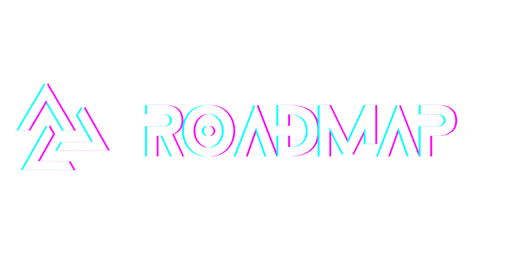

  

<h2 align="center">Public Roadmap for the Automagik Ecosystem</h2>

  <strong>🗺️ Transparency, Ownership, Results-Driven</strong> 
  Strategic initiatives across Omni, Hive, Spark, Forge, Genie, and Tools 
  Track what we're building, why we're building it, and who's building it

  
  
  

  <a href="#-projects">Projects</a> •
  <a href="#-how-to-propose">How to Propose</a> •
  <a href="#-labels--stages">Labels & Stages</a> •
  <a href="#-contributing">Contributing</a> •
  <a href="#-documentation">Documentation</a>

---

## 🗺️ What is the Automagik Roadmap?

This repository is the **single source of truth** for strategic initiatives across the entire Automagik ecosystem. Think of it as:

- 📊 **The Command Center**: Where all projects align on priorities and timelines
- 🎯 **The Context Repository**: Strategic analysis (5w2h) and detailed wishes for each project
- 🤝 **The Community Hub**: Where stakeholders provide feedback and track progress
- 📈 **The Progress Tracker**: From Wishlist → Exploring → RFC → Prioritization → Executing → Preview → Shipped

### 💡 Why a Public Roadmap?

**Transparency** builds trust. **Ownership** drives results. **Structure** enables scale.

**Before:**
- ❌ Roadmap scattered across Slack, Notion, and individual heads
- ❌ Community asks "when will X be ready?" without visibility
- ❌ Cross-project dependencies create surprise blockers
- ❌ No clear ownership = things fall through the cracks

**After (with this repo):**
- ✅ Single place to see what's being built across all projects
- ✅ Clear RASCI ownership (Responsible, Accountable, Support, Consulted, Informed)
- ✅ Expected results tracked for every initiative
- ✅ Community can comment, vote, and contribute ideas
- ✅ Quarterly planning and review cadence

---

## 🚀 Projects

| Project | Description | Repository | Context |
|---------|-------------|------------|---------|
| **[Omni](projects/omni/)** | Omnichannel messaging with MCP | [automagik-omni](https://github.com/namastexlabs/automagik-omni) | [5w2h](projects/omni/5w2h.md) |
| **[Hive](projects/hive/)** | Multi-agent orchestration | [automagik-hive](https://github.com/namastexlabs/automagik-hive) | [5w2h](projects/hive/5w2h.md) |
| **[Spark](projects/spark/)** | Cron system that sparks repos | [automagik-spark](https://github.com/namastexlabs/automagik-spark) | [5w2h](projects/spark/5w2h.md) |
| **[Forge](projects/forge/)** | AI-powered development orchestrator | [automagik-forge](https://github.com/namastexlabs/automagik-forge) | [5w2h](projects/forge/5w2h.md) |
| **[Genie](projects/genie/)** | Autonomous agent framework | [automagik-genie](https://github.com/namastexlabs/automagik-genie) | [5w2h](projects/genie/5w2h.md) |
| **[Tools](projects/tools/)** | MCP tools builder & marketplace | [automagik-tools](https://github.com/namastexlabs/automagik-tools) | [5w2h](projects/tools/5w2h.md) |

Each project folder contains:
- **5w2h.md** - Strategic analysis (What, Why, Who, When, Where, How, How Much)
- **wishes/** - Detailed initiative plans following the [automagik-genie](https://github.com/namastexlabs/automagik-genie) pattern
- **README.md** - Project overview with repository links

---

## 📊 View the Roadmap

🔗 **[View Project Board](https://github.com/orgs/namastexlabs/projects/9)** - Live project board with all initiatives

**Quick Filters:**
- 📅 [All Initiatives](https://github.com/namastexlabs/automagik-roadmap/issues?q=is%3Aissue+label%3Ainitiative)
- 🚧 [Executing](https://github.com/namastexlabs/automagik-roadmap/issues?q=is%3Aissue+label%3AExecuting)
- 📋 [Prioritization](https://github.com/namastexlabs/automagik-roadmap/issues?q=is%3Aissue+label%3APrioritization)
- ✅ [Shipped](https://github.com/namastexlabs/automagik-roadmap/issues?q=is%3Aissue+label%3AShipped)
- ⚡ [This Quarter (Q4 2025)](https://github.com/namastexlabs/automagik-roadmap/issues?q=is%3Aissue+label%3Aquarter%3A2025-q4)
- 🔥 [High Priority](https://github.com/namastexlabs/automagik-roadmap/issues?q=is%3Aissue+label%3Apriority%3Ahigh+label%3Ainitiative)

---

## 📋 How to Propose

**Want to suggest a new initiative?**

1. **[Create a new issue](../../issues/new/choose)** using the **Initiative template**
2. Fill in the required fields:
   - **Project**: Which Automagik project(s) are affected
   - **Description**: What are we building and why?
   - **Expected Results**: Measurable outcomes (RESULTADO_ESPERADO)
   - **RASCI Ownership**: Who's responsible, accountable, supporting, consulted, informed
3. Add relevant **labels** (project, stage, priority, quarter, area)
4. The issue will **automatically** be added to the project board
5. Community can **comment** and provide feedback

**💬 Community feedback is welcome!** Share your thoughts on any initiative.

---

## 🏷️ Labels & Stages

### Development Stages

Our initiatives follow a structured lifecycle inspired by [GitHub's public roadmap](https://github.com/github/roadmap):

- 💡 **Wishlist** - Initial ideation and brainstorming
- 🔍 **Exploring** - Early investigation, validating the idea
- 💬 **RFC** - Request for comments, gathering community feedback
- 📋 **Prioritization** - Prioritization and planning phase
- 🔨 **Executing** - Active execution and implementation
- 🧪 **Preview** - Beta/preview release for testing
- ✅ **Shipped** - Generally available, live in production
- 📦 **Archived** - No longer active or deprioritized

### Multi-Dimensional Labels

We use a **6-dimensional label system** to organize initiatives:

| Dimension | Examples | Purpose |
|-----------|----------|---------|
| **Project** | `project:omni`, `project:hive` | Which project(s) are involved |
| **Stage** | `Exploring`, `Executing` | Current development phase |
| **Type** | `type:feature`, `type:research` | Kind of initiative |
| **Priority** | `priority:critical`, `priority:high` | Urgency level |
| **Quarter** | `quarter:2025-q4`, `quarter:2026-q1` | Target timeframe |
| **Area** | `area:api`, `area:mcp`, `area:agents` | Technical domain |

**Total:** ~40 labels across 6 dimensions for precise organization.

[View complete label guide →](docs/label-guide.md)

---

## 📚 Documentation

- **[Stage Definitions](docs/stage-definitions.md)** - Detailed criteria for each stage
- **[Label Guide](docs/label-guide.md)** - Complete label taxonomy and usage
- **[RASCI Guide](docs/rasci-guide.md)** - Ownership model for open source projects
- **[Wish Template](docs/wish-template.md)** - How to structure detailed initiatives
- **[Cross-Repo References](docs/cross-repo-references.md)** - Linking initiatives across repos

---

## 📊 CSV Export

Weekly CSV exports are available in [`exports/`](exports/) for stakeholder reporting and analysis.

**Export format includes:**
- Project, Initiative, Description
- Stage, Quarter, Priority
- Expected Results
- Owner, Created/Updated dates
- Links to issues and wish folders

Exports run **automatically every Monday** via GitHub Actions.

---

## 🤝 Contributing

We welcome community input on our roadmap!

**How to contribute:**
- 💬 **Comment on issues** to share feedback and ideas
- 🎯 **Propose new initiatives** via issue templates
- 📝 **Create detailed wishes** in project folders
- 💡 **Join discussions** on our [Discord](https://discord.gg/xcW8c7fF3R)

See [CONTRIBUTING.md](CONTRIBUTING.md) for detailed guidelines.

---

## ⚖️ Disclaimer

This roadmap represents our **current plans and priorities**. Items may change based on:
- Community feedback and feature requests
- Technical constraints and dependencies
- Strategic shifts and market changes
- Resource availability and capacity

**No dates or commitments are guaranteed.** This is a living document that evolves with the ecosystem.

---

## 🔗 Links

- **Discord**: [Join the community](https://discord.gg/xcW8c7fF3R)
- **GitHub Org**: [@namastexlabs](https://github.com/namastexlabs)
- **Documentation**: [docs.automagik.ai](https://docs.automagik.ai)

---

## 📜 License

MIT License - See [LICENSE](LICENSE)

---

  <strong>Built with transparency by <a href="https://github.com/namastexlabs">Namastex Labs</a></strong> 
  Questions? Check our <a href="docs/faq.md">FAQ</a> or reach out on <a href="https://discord.gg/xcW8c7fF3R">Discord</a>

